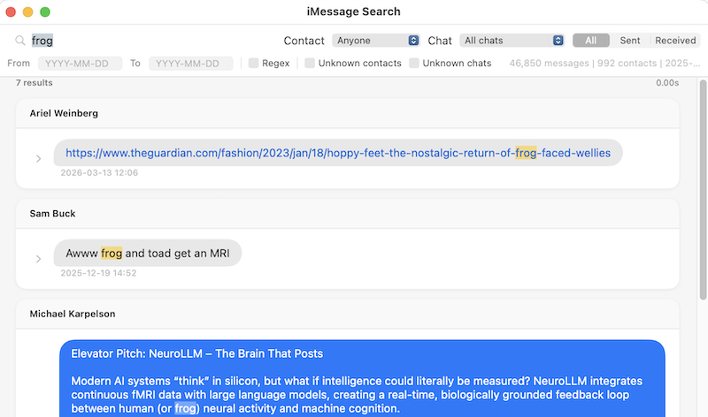

# iMessage Search

You should be able to search your Apple Messages within Apple Messages. But the built in search is awful and half-assed, so here we are.



## Install

Download `iMessage.Search.app.zip` from the [latest release](https://github.com/dmd/imessage-search/releases/latest), unzip, and drag to `/Applications/`.

Since the app isn't notarized with Apple, macOS will block it on first launch. To fix this, run once:
```
xattr -cr "/Applications/iMessage Search.app"
```

## Building from source

```
./build-app.sh
```

This builds the Swift package and creates `dist/iMessage Search.app`.

## Requirements

- macOS 14 (Sonoma) or later
- Xcode Command Line Tools (`xcode-select --install`)
- **Full Disk Access** — the app reads your Messages and Contacts databases in read-only mode. Go to System Settings > Privacy & Security > Full Disk Access, click +, and add iMessage Search.

## Features

- Full-text search across all messages
- Filter by contact, chat, date range, and direction (sent/received)
- Regex search (probably? idk I barely tested that bit)
- Conversation context expansion (click the triangle)
- Inline image attachment previews
- Group chat support with resolved contact names
